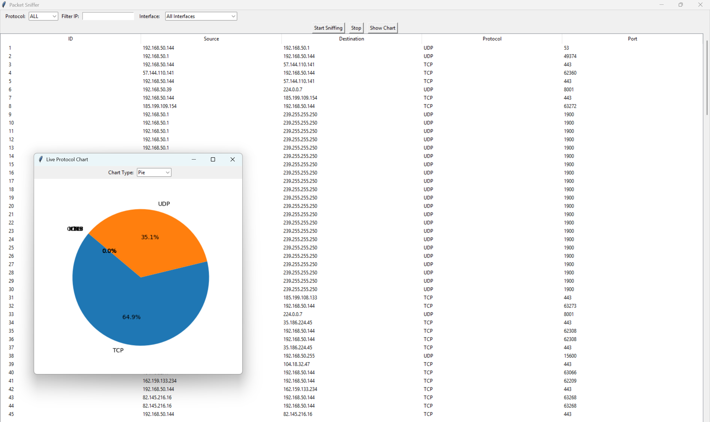

# Packet Sniffer GUI (Python + Scapy + Tkinter)

A real-time desktop packet sniffer and analyzer built with Python, Scapy, and Tkinter.  
Monitor network traffic by protocol, view packet details, and visualize activity live with charts.



---

## Features

- **Live packet capture** with IP filtering and protocol selection
- **Real-time protocol chart** (Pie or Bar)
- **Interface selection** (Wi-Fi, Ethernet, Loopback, etc.)
- **Packet detail viewer** (double-click any row)
- Clean interface with filtering options

---

## Requirements

- Python 3.10 or later
- `scapy`
- `matplotlib`

Install dependencies:

```
pip install scapy matplotlib
```
## How to run

```
python main.py
```
